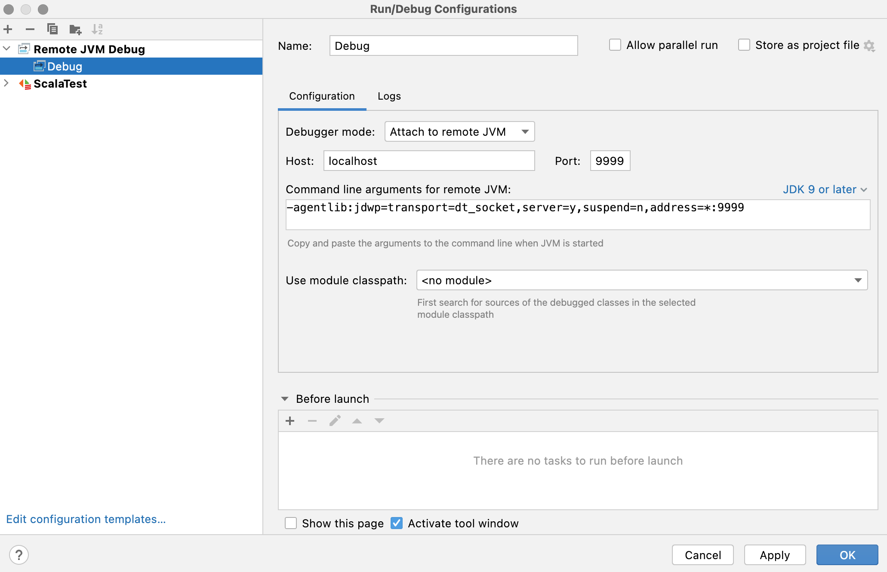

# EORI Common Component Registration Frontend

Frontend application for the the ECC (EORI Common Component) Registration service. This service handles EORI Registration journey.

Other related ECC services:
- Backend service: [EORI Common Component](https://github.com/hmrc/eori-common-component)
- Stubs: [EORI Common Component Stubs](https://github.com/hmrc/eori-common-component-hods-stubs)
- Proxy: [EORI Common Component Hods Proxy](https://github.com/hmrc/eori-common-component-hods-proxy)
- Subscription service: [EORI Common Component Frontend](https://github.com/hmrc/eori-common-component-frontend)

## Development

This service is written in [Scala](http://www.scala-lang.org/) and [Play](http://playframework.com/), and requires Java 11 [JRE](https://www.java.com/en/download/manual.jsp) to run.

To develop or run service locally you'll also need:
- [Service Manager](https://github.com/hmrc/service-manager)
- [SBT](https://www.scala-sbt.org/)
- [Docker Desktop](https://docs.docker.com/desktop/) (Optional. Makes it easier to run external dependencies, e.g. Mongo Database locally)

### Service Manager Commands

What's running?

    sm2 -s

Start the required development services (make sure your service-manager-config folder is up to date)

    sm2 --start EORI_COMMON_COMPONENT_ALL

Stop all ECC related services

    sm2 --stop EORI_COMMON_COMPONENT_ALL

### Running locally

When running locally you can access the start page via [http://localhost:6751/customs-registration-services/cds/register]().

All subsequent pages in the flow are authentication protected, so you'll need a Government Gateway login to proceed.

Government Gateway login stub can be accessed via [http://localhost:9949/auth-login-stub/gg-sign-in]() after all required service-manager services are started.

To run EORI Common Component Registration Frontend using default port number
    
    sbt run

### Debugging

Before debugging locally you will need to stop the Service Manager-started `eori-common-component-registration-frontend` service

    sm2 --stop EORI_COMMON_COMPONENT_REGISTRATION_FRONTEND

Then start your local debugging session on the expected port

    sbt -jvm-debug 9999 run

And finally connect and set-up debugger; Intellij set-up example

### Testing

#### [ScalaTest](https://www.scalatest.org/)

We're using ScalaTest for Unit and Integration tests.

You can run unit test suite with

    sbt test

To run integration test suit execute

    sbt it:test

To run all test suites together with Scoverage and ScalaFMT code formatting execute script

    ./precheck.sh

#### [Scoverage](https://github.com/scoverage/sbt-scoverage)

We're using Scoverage to check the code coverage of our test suites.

You can run this on the command line with

    sbt clean coverage test it:test coverageReport

Adjust the following in `build.sbt` to configure Scoverage

    ...
    ScoverageKeys.coverageMinimum := 80,
    ScoverageKeys.coverageFailOnMinimum := false,
    ...

### Architecture and Flows

High level journey diagram with APIs involved is [documented in Confluence](https://confluence.tools.tax.service.gov.uk/pages/viewpage.action?spaceKey=ECC&title=Journey+Flow+maps).

Different journeys and scenarios can be triggered using [documented scenarios](https://confluence.tools.tax.service.gov.uk/display/ECC/Testing+in+Stubbed+Environments+-+Subscription).

# License
This code is open source software licensed under the [Apache 2.0 License]("http://www.apache.org/licenses/LICENSE-2.0.html").
